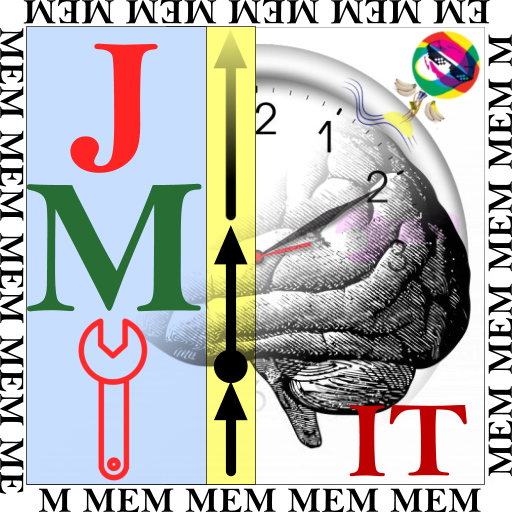
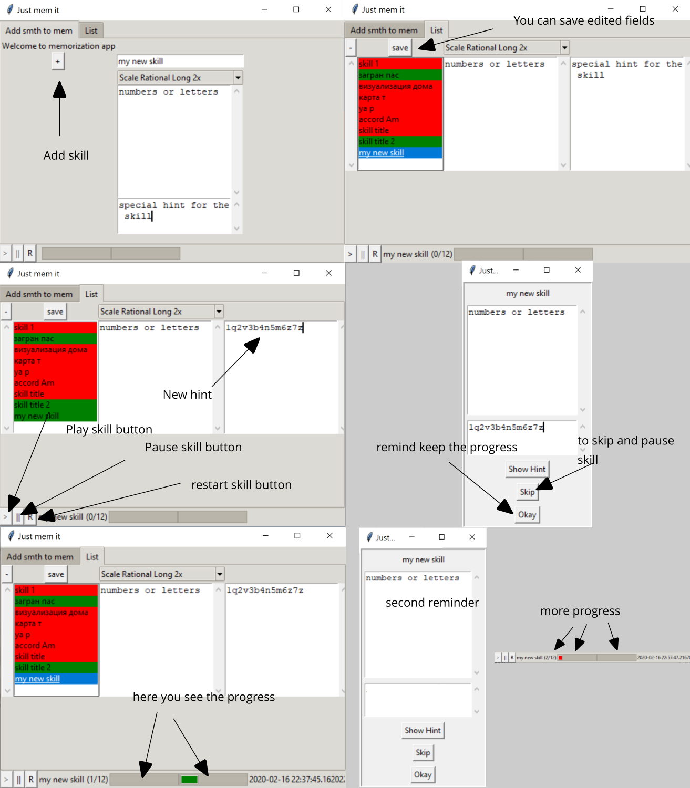

<p align="center">

</p>

# just-mem-it
**Just Mem It** tool is a tool for memory and skill development.


# run v. 0.0.1
```
python justMemIt.py
```

# target
1. to memorize information
2. to remind for skill development action

# why?
There are different fine intervals for information memorization, see [forgetting curve](https://ru.wikipedia.org/wiki/%D0%9A%D1%80%D0%B8%D0%B2%D0%B0%D1%8F_%D0%B7%D0%B0%D0%B1%D1%8B%D0%B2%D0%B0%D0%BD%D0%B8%D1%8F) for more details.

# technical details
```
mem/scales.json        - scales description
mem/all.jsom           - example of memorized item
mem/progress.priv.json - your private progress
```

More screens and feature development phases are [here](https://silkmind.com/just-mem-it/). Calculator for time intervals used in scales is [here](https://silkmind.com/just-mem-it/times).

# HOWTO

1. add skill

    title, description, hint information and the scale
2. run `play` on List tab
3. check remind win which on each timer
4. see the progress
5. keep pushing forward your skill and memory development



# details for scale information:

Rational Ebbinghaus scale - 4 times - [1 sec, 20 min, 8 hours, 1 day]
```
scale = {
  "title" : "Scale Rational Ebbinghaus",
  "intervals" : [1,1200, 28800, 86400]
}
```

Rational Long scale - 5 times - [1 sec, 20 min, 1 day, 2 days, 2 months]
```
scale = {
  "title" : "Scale Rational Long",
  "intervals" : [1,1200, 86400, 172800, 5184000]
}
```

"B.Salivan - H. Thompson" scale intervals are [5 sec, 25 sec, 2 min, 10 min, 1 hour, 5 hours, 1 day, 5 days, 25 days, 4 months, 2 years, ...]
```
scale = {
  "title"    : "Scale B.Salivan - H. Thompson",
  "type"     : "generative",
  "func"     : "lambda x: x[0] * 5 if (x[1] % 2 == 0) else x[0] * 6",
  "firstVal" : 5
}
```
more details in urls/books
1. [The Plateau Effect: Getting From Stuck to Success by Bob Sullivan and Hugh Thompson](https://www.amazon.com/Plateau-Effect-Getting-Stuck-Success/dp/0525952802)
2. [Эффект плато. Как преодолеть застой и двигаться дальше, Салливан Б., Томпсон Х., 2014](https://www.chitai-gorod.ru/catalog/book/712752/)
2. [Plateau effect](https://en.wikipedia.org/wiki/Plateau_effect)

# keep in mind
It's works for me and it's my first python tkinter app. There are lot of improvements I see:

* code refactoring
* GUI improvement
* Linux tests
* unit tests
* examples
* more scales and descriptions
* video

By the way I have already learned my passport and bank cards and now work with eye-vision restoration practices.

# links, search and social media
  Official hashtag is #justmemittool
